

  <a href="https://owongit.github.io">
    
  </a>

  
  
  
  

<h3 align="center">
  🔭 <a href="https://owongit.github.io">See more projects, full image galleries and write-ups on my portfolio →</a>
</h3>

 

## About

- ⚡ **Hardware & Systems Engineer at IBM**, Poughkeepsie, NY
- 🎓 **B.S. Electrical & Computer Engineering**, University of Washington (2026)
- 🚀 Former **Ground Systems Lead** at the Society for Advanced Rocket Propulsion: a 17-person team owning propellant loading, ignition sequencing and flight telemetry
- 🏆 **1st of 72 teams** at the UW Industry Capstone Showcase for a Blue Origin-sponsored antenna study
- 🔧 Previously embedded systems at **Zonar Systems** and systems & controls at **Zap Energy**

## Project Gallery

Select a project to jump to its write-up below.

<table>
  <tr>
    <td width="33%" align="center" valign="top">
      <a href="#rocket-engine-daq-board">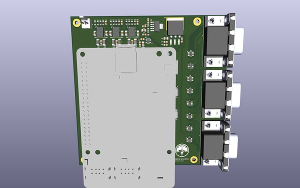</a>
       <b>Rocket Engine DAQ Board</b>
       SARP · PCB design
    </td>
    <td width="33%" align="center" valign="top">
      <a href="#live-daq-dashboard">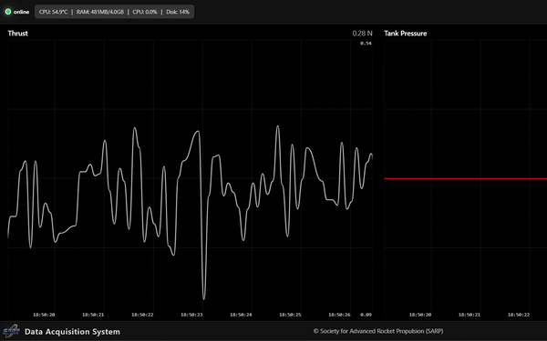</a>
       <b>Live DAQ Dashboard</b>
       SARP · Python + Flask
    </td>
    <td width="33%" align="center" valign="top">
      
       <b>Hot-Fire Monitoring</b>
       SARP · LabVIEW
    </td>
  </tr>
  <tr>
    <td width="33%" align="center" valign="top">
      <a href="#hv-capacitor-test-stand">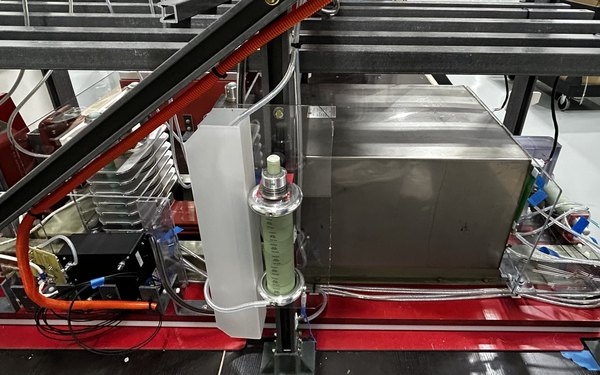</a>
       <b>HV Capacitor Test Stand</b>
       Zap Energy · Controls
    </td>
    <td width="33%" align="center" valign="top">
      <a href="#antenna-substrate-study">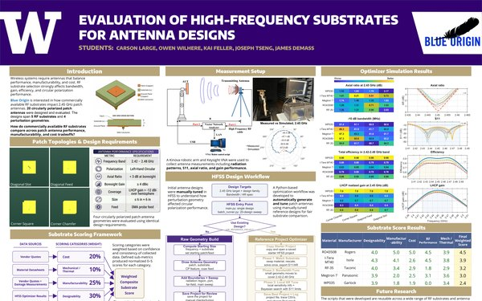</a>
       <b>Antenna Substrate Study</b>
       Blue Origin × UW · 🏆 1st of 72
    </td>
    <td width="33%" align="center" valign="top">
      
       <b>UniFi Camera Wall</b>
       Personal · Python
    </td>
  </tr>
  <tr>
    <td width="33%" align="center" valign="top">
      <a href="#nfc-business-card">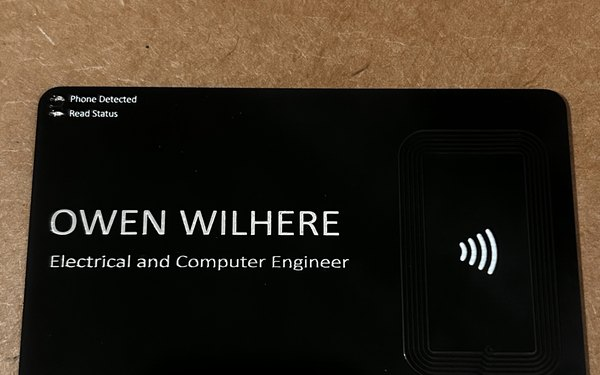</a>
       <b>NFC Business Card</b>
       Personal · PCB design
    </td>
    <td width="33%" align="center" valign="top">
      <a href="#launch-relay-board">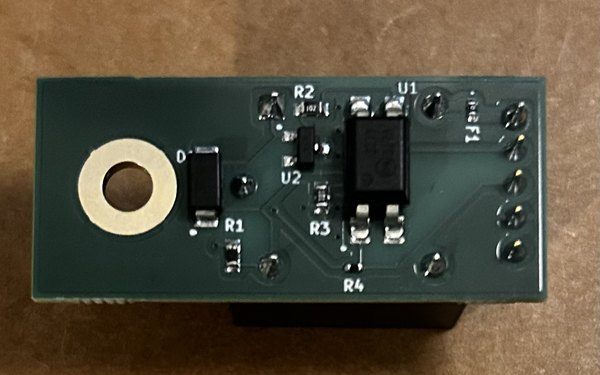</a>
       <b>Launch Relay Board</b>
       SARP · PCB design
    </td>
    <td width="33%" align="center" valign="top">
      <a href="#field-daq-enclosure">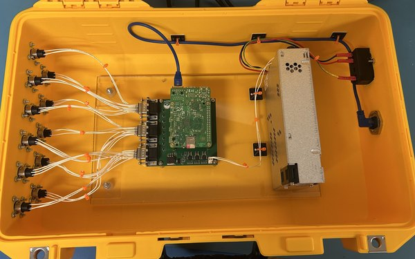</a>
       <b>Field DAQ Enclosure</b>
       SARP · System integration
    </td>
  </tr>
  <tr>
    <td width="33%" align="center" valign="top">
      <a href="#tcu-debug-terminal">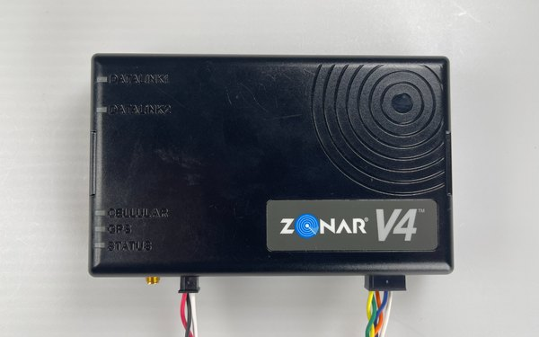</a>
       <b>TCU Debug Terminal</b>
       Zonar Systems · Python
    </td>
    <td width="33%" align="center" valign="top">
      <a href="#polybot-scanner">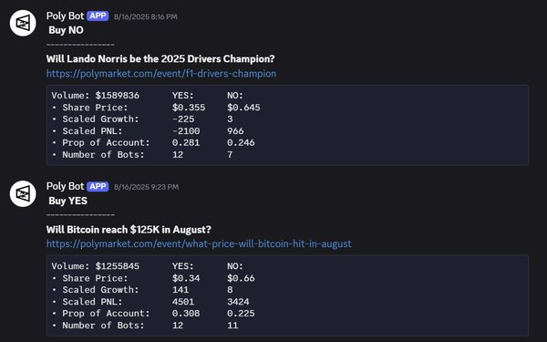</a>
       <b>PolyBot Scanner</b>
       Personal · Python
    </td>
    <td width="33%" align="center" valign="top">
      <a href="https://owongit.github.io"></a>
       <b>Everything else</b>
       owongit.github.io
    </td>
  </tr>
</table>

## Featured Builds

Open-source hardware and software, each with a public repository.

### Rocket Engine DAQ Board

<table>
  <tr>
    <td width="46%" valign="top">
      <a href="https://github.com/OWongit/DAQ_Hardware">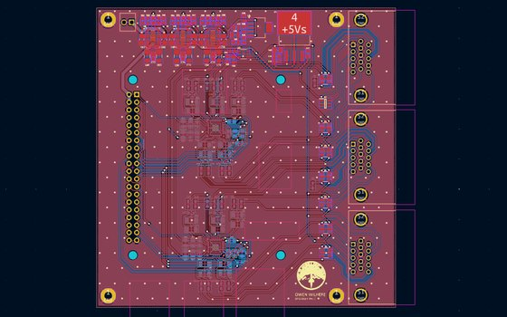</a>
    </td>
    <td width="54%" valign="top">

SOCIETY FOR ADVANCED ROCKET PROPULSION

A Raspberry Pi DAQ board for the load cells, pressure transducers and RTDs on a rocket engine test stand. Sensors come in through three 15-pin D-subs with TVS protection and RC filtering, then go to dual 24-bit ADS124S08 ADCs over SPI. A 24 V input feeds a low-noise power tree of bucks, LDOs and voltage references. The board is under 10 × 10 cm.

<a href="#project-gallery">↑ Gallery</a>

</td>
  </tr>
</table>

### Live DAQ Dashboard

<table>
  <tr>
    <td width="54%" valign="top">

SOCIETY FOR ADVANCED ROCKET PROPULSION

The software half of the DAQ. It reads both ADCs (spidev + gpiod) at 2.5–4000 Hz, converts the readings to engineering units and logs every channel to timestamped CSVs. A Flask + Socket.IO server streams live data to a browser dashboard with:

- auto-scaling plots for up to 11 sensors;
- system-health stats and CSV export;
- ADC and sensor configuration uploaded from a file.

The photo shows it running in the field control center during a hot-fire.

<a href="#project-gallery">↑ Gallery</a>

</td>
    <td width="46%" valign="top">
      <a href="https://github.com/OWongit/DAQ_software">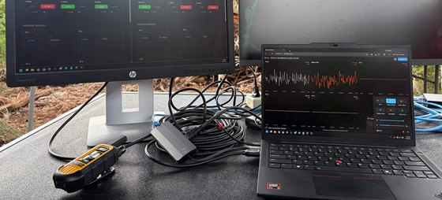</a>
    </td>
  </tr>
</table>

### UniFi Camera Wall

<table>
  <tr>
    <td width="46%" valign="top">
      <a href="https://github.com/OWongit/Unifi-Viewport-Alternative">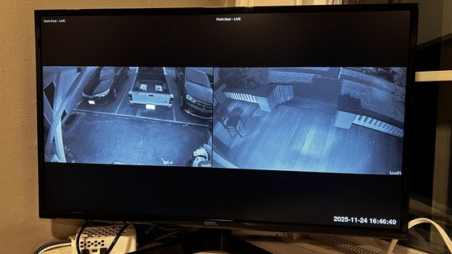</a>
    </td>
    <td width="54%" valign="top">

PERSONAL PROJECT

A fullscreen grid of UniFi Protect camera streams:

- cameras are discovered automatically through the Protect API;
- RTSP streams are pulled through the Protect API;
- motion-detection webhooks flash a blue border around the active camera.

It runs 24/7 on a Raspberry Pi with under 250 ms latency, replacing Ubiquiti's $200 Viewport and saving about $140.

<a href="#project-gallery">↑ Gallery</a>

</td>
  </tr>
</table>

### NFC Business Card

<table>
  <tr>
    <td valign="top">

PERSONAL PROJECT

A PCB business card that sends my LinkedIn when you tap it with a phone. It needs no battery: it harvests energy from the phone's NFC field.

- The harvested supply lights a *phone detected* LED.
- The chip's field-detect output drives a *read status* LED that stays on only while data is moving.
- No copper or components sit inside the antenna loop, which keeps the RF path clean.

<a href="#project-gallery">↑ Gallery</a>

</td>
    <td width="240" valign="top">
      <a href="https://github.com/OWongit/PCB_Business_Card">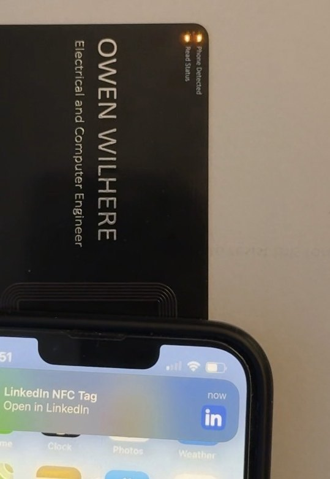</a>
    </td>
  </tr>
</table>

### Launch Relay Board

<table>
  <tr>
    <td width="46%" valign="top">
      <a href="https://github.com/OWongit/Relay-Switch-for-Launch-Controller">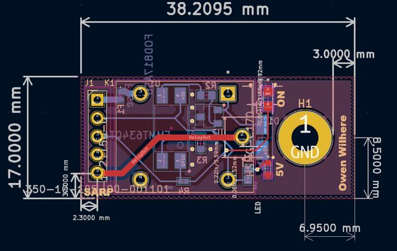</a>
    </td>
    <td width="54%" valign="top">

SOCIETY FOR ADVANCED ROCKET PROPULSION

A detachable relay daughterboard for the launch controller that actuates the rocket's fuel-fill valve. It replaces the controller's failure-prone relay circuit with a module that can be swapped out.

- LEDs confirm both the 5 V control signal and the microcontroller input.
- An in-line fuse guards the valve power line.
- The two-layer board plugs into the main board through a 5-pin connector.

<a href="#project-gallery">↑ Gallery</a>

</td>
  </tr>
</table>

### PolyBot Scanner

<table>
  <tr>
    <td width="54%" valign="top">

PERSONAL PROJECT

A bot that scans Polymarket markets continuously. For each market it pulls wallet data on the 40 largest holders and computes growth, PnL and position stats. Markets that meet configurable *Buy* criteria go to a Discord channel. A Google Sheet, kept live by Apps Script, tracks every market.

<a href="#project-gallery">↑ Gallery</a>

</td>
    <td width="46%" valign="top">
      <a href="https://github.com/OWongit/PolyBotScan">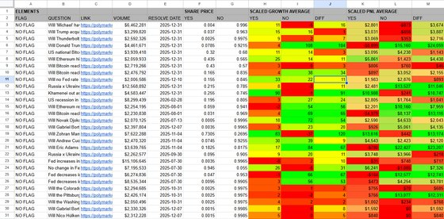</a>
    </td>
  </tr>
</table>

## Industry & Research Work

Professional and team projects without public code. The full image galleries are on the <a href="https://owongit.github.io">portfolio</a>.

### HV Capacitor Test Stand

<table>
  <tr>
    <td width="46%" valign="top">
      <a href="https://owongit.github.io">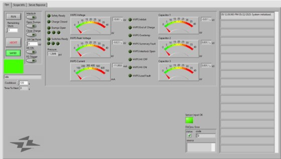</a>
    </td>
    <td width="54%" valign="top">

ZAP ENERGY, INC.

The control system for a high-voltage capacitor discharge test stand used in pulsed-power work. My part:

- integrated the trigger and feedback hardware with LabVIEW, repurposing legacy signals to drive new relay and ignitron switches;
- modified the voltage-measurement boards to handle up to 48 kV;
- traced and documented the legacy safety interlock circuit.

<a href="#project-gallery">↑ Gallery</a>

</td>
  </tr>
</table>

### Antenna Substrate Study

<table>
  <tr>
    <td width="54%" valign="top">

UNIVERSITY OF WASHINGTON × BLUE ORIGIN SENIOR CAPSTONE

A study of how five commercial RF substrates affect the performance, manufacturability and cost of 2.45 GHz circularly polarized patch antennas.

- We designed 20 antennas across four perturbation geometries.
- A Python optimizer drove Ansys HFSS to tune them.
- We measured the fabricated boards with a Kinova robotic arm and a Keysight VNA.
- A weighted scoring framework ranked Rogers RO4350B first.

**🏆 1st place of 72 industry-sponsored teams.**

<a href="#project-gallery">↑ Gallery</a>

</td>
    <td width="46%" valign="top">
      <a href="https://owongit.github.io/projects/Blue%20Origin/Blue-Origin-EVALUATION-OF-HIGH-FREQUENCY-SUBSTRATES-1.pdf">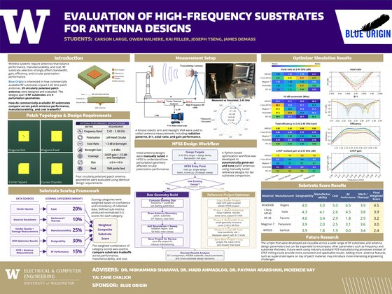</a>
    </td>
  </tr>
</table>

### Hot-Fire Monitoring

<table>
  <tr>
    <td width="46%" valign="top">
      <a href="https://owongit.github.io">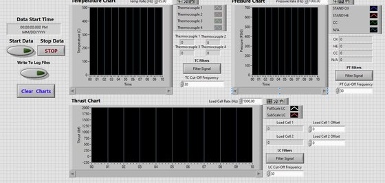</a>
    </td>
    <td width="54%" valign="top">

SOCIETY FOR ADVANCED ROCKET PROPULSION

An NI DAQ + LabVIEW system that captures load cell and pressure transducer signals during a rocket engine hot-fire and displays pressure, thrust and temperature in real time. Operators can toggle signal filtering and record to a spreadsheet. The system includes wire harnessing that routes the sensor and excitation lines.

<a href="#project-gallery">↑ Gallery</a>

</td>
  </tr>
</table>

### Field DAQ Enclosure

<table>
  <tr>
    <td width="54%" valign="top">

SOCIETY FOR ADVANCED ROCKET PROPULSION

A ruggedized case that takes the DAQ board into the field.

- Inside, a 120 VAC → 24 VDC supply is kept apart from the sensitive analog paths to limit EMI and stay thermally stable.
- Outside, 11 circular Amphenol connectors handle sensor I/O.
- A weather-sealed RJ45 port carries data over Ethernet.

<a href="#project-gallery">↑ Gallery</a>

</td>
    <td width="46%" valign="top">
      <a href="https://owongit.github.io">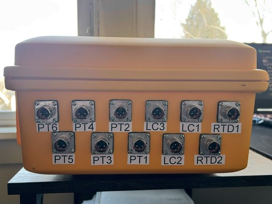</a>
    </td>
  </tr>
</table>

### TCU Debug Terminal

<table>
  <tr>
    <td width="46%" valign="top">
      <a href="https://owongit.github.io">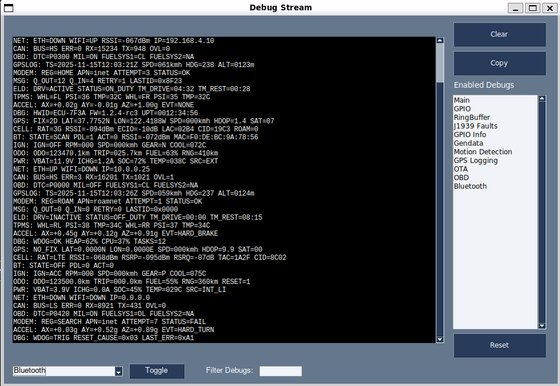</a>
    </td>
    <td width="54%" valign="top">

ZONAR SYSTEMS, INC.

A debug terminal for the Zonar V4 telematics control unit, an embedded fleet-tracking device. It talks to the unit over RS-232 to send commands and capture logs, which sped up QA and root-cause analysis.

- Debug streams can be toggled and filtered by type.
- A double-click guard stops logs from being cleared by accident.

<a href="#project-gallery">↑ Gallery</a>

</td>
  </tr>
</table>

## Toolbox

<table>
  <tr>
    <td><b>Hardware</b></td>
    <td>
      
      
      
      
      
    </td>
  </tr>
  <tr>
    <td><b>Languages</b></td>
    <td>
      
      
      
      
      
      
      
    </td>
  </tr>
  <tr>
    <td><b>Interfaces</b></td>
    <td>
      
      
      
      
      
      
    </td>
  </tr>
  <tr>
    <td><b>Platforms</b></td>
    <td>
      
      
      
      
      
    </td>
  </tr>
  <tr>
    <td><b>Lab</b></td>
    <td>
      
      
      
      
      
    </td>
  </tr>
</table>

<b>More repositories</b>: coursework in FPGA design, RISC-V assembly and Java

 

| Repository | What it does | Language |
|---|---|---|
| [16x16-Connect-Four-SV](https://github.com/OWongit/16x16-Connect-Four-SV) | Connect Four on a 16 × 16 LED array |  |
| [Tug-of-War-vs-Computer](https://github.com/OWongit/Tug-of-War-vs-Computer) | Tug of war against the computer; the pull strength follows how fast you press the button |  |
| [Tug-of-War](https://github.com/OWongit/Tug-of-War) | Two-player tug of war on an LED display |  |
| [Runway-Lights](https://github.com/OWongit/Runway-Lights) | A 3-LED finite-state machine that animates runway hazard lights |  |
| [Convert-String-to-Integer](https://github.com/OWongit/Convert-String-to-Integer) | Parses a string into an integer |  |
| [Fibonacci-Calculator](https://github.com/OWongit/Fibonacci-Calculator) | Recursive Fibonacci |  |
| [Mini-Git](https://github.com/OWongit/Mini-Git) | A simplified Git-style version control system built on linked lists |  |
| [Message-Encoder-Decoder](https://github.com/OWongit/Message-Encoder-Decoder) | Encodes and decodes messages typed in or loaded from a file |  |
| [Disaster-Relief-System](https://github.com/OWongit/Disaster-Relief-System) | Allocates relief funds to help the most people |  |
| [Strategy-Games-Java](https://github.com/OWongit/Strategy-Games-Java) | Connect Four and Tic-Tac-Toe |  |
| [Personality-Quiz](https://github.com/OWongit/Personality-Quiz) | A BuzzFeed-style personality quiz |  |
| [OWongit.github.io](https://github.com/OWongit/OWongit.github.io) | My portfolio site: vanilla HTML/CSS/JS with JSON-driven project galleries |  |

 

  

